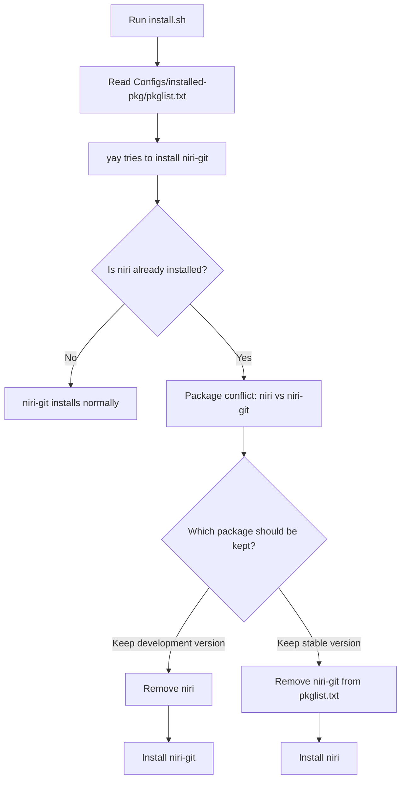

# Package conflicts

## `niri` vs `niri-git`

The package list currently installs `niri-git` from `Configs/installed-pkg/pkglist.txt`.
On Arch-based systems, `niri` and `niri-git` provide the same compositor and conflict with each other.

If `niri` is already installed, the installer can stop with:

```text
:: niri-git and niri are in conflict. Remove niri? [y/N]
error: unresolvable package conflicts detected
```

### Flow



### Fix options

Use one of these paths:

- Keep `niri-git`: remove the stable package when prompted, or run `sudo pacman -R niri` before installing.
- Keep stable `niri`: replace `niri-git` with `niri` in `Configs/installed-pkg/pkglist.txt`.

The installer should eventually make this choice explicit instead of failing during package resolution.
